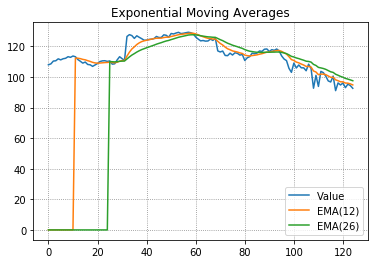
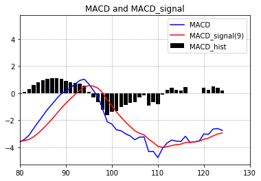

# fsp-demos
Simple analysis tools and demonstrations for financial signal processing.

## Introduction
Exponential Moving Averages Plotting

MACD Plotting

## Technologies Used
- Languages - Python3
- Libraries - matplotlib, numpy, pandas, unittest
- Live Editor - Jupyter Notebook

## Cleanup Tasks
- [ ] Use subplots on MACD notebook to align x axes on plots.
- [ ] Migrate all functions to a single helper file
- [ ] Organize directory with folders
- [ ] Add [Plotly](https://plotly.com/python/) for interactive plots

## License
Distributed under the MIT license. See LICENSE for details.
